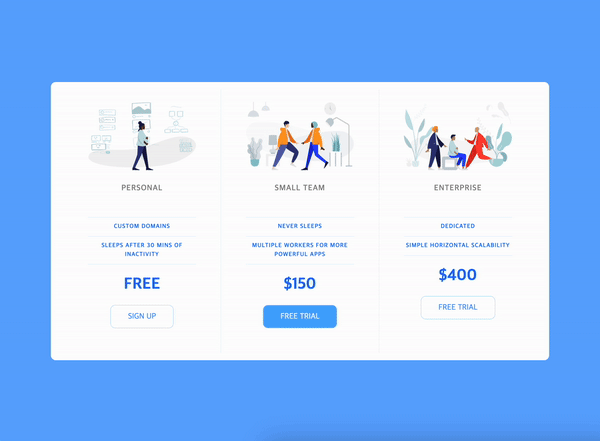

# Pricing Panel

이 프로젝트는 반응형 디자인을 연습하기 위해 만들어진 Pricing Panel입니다.

화면 크기에 따라 가격표의 형태가 변화하여 사용자에게 최적화된 환경을 제공합니다.

 

## Tool

 

## Feature details

`Flexbox`: `Flexbox`를 사용하여 가격표 요소들을 유연하게 배치하고 정렬했습니다.

`Media Queries`: `Media Queries`를 활용하여 화면 크기에 따라 가격표의 형태와 레이아웃을 동적으로 조절했습니다.

`Resposive Design`: 모바일 화면과 같은 작은 화면에서는 간소화된 형태로, PC와 같은 큰 화면에서는 보다 상세한 정보를 제공하도록 디자인 되었습니다.

 

## How to run and Test in local environment

깃 클론 후, `index.html` 파일을 브라우저로 열어 실행합니다.

 

## Preview

